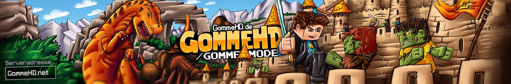

Gommemode is a fun Minecraft mod, that allows you to spawn GommeHD and play the [Gomme hymn](https://www.youtube.com/watch?v=2h1BJCxtNes) produced by [Lukas, der Rapper](https://www.instagram.com/luzudemkas/).

 